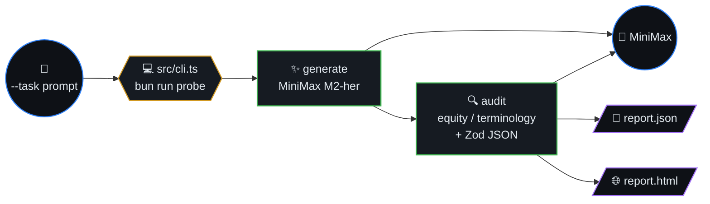
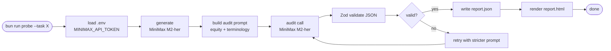
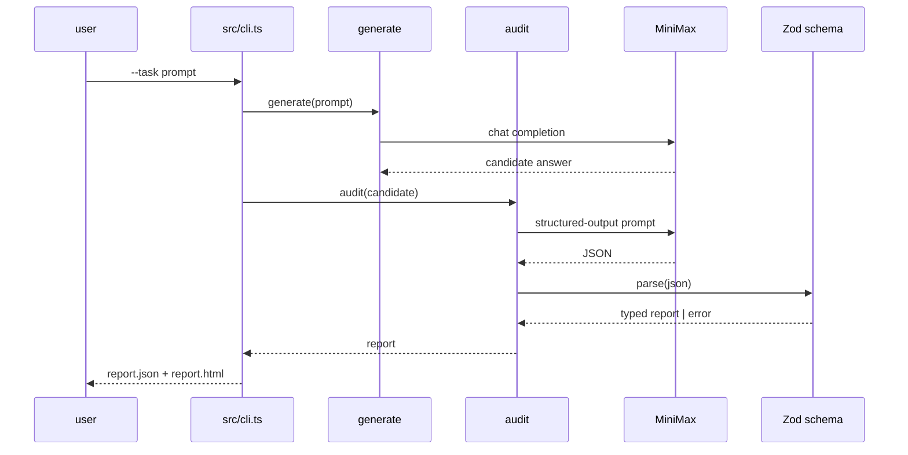
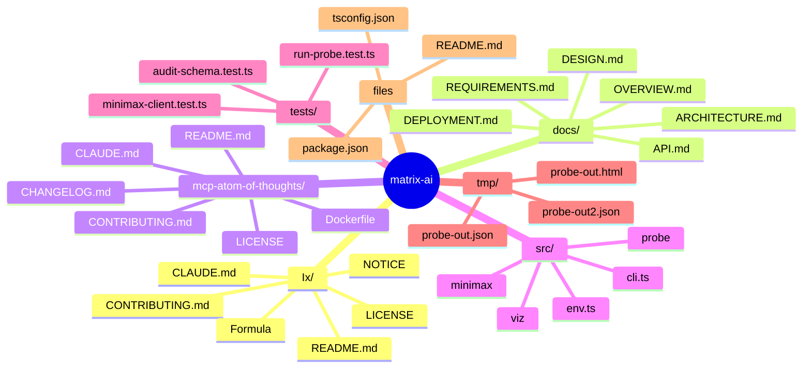
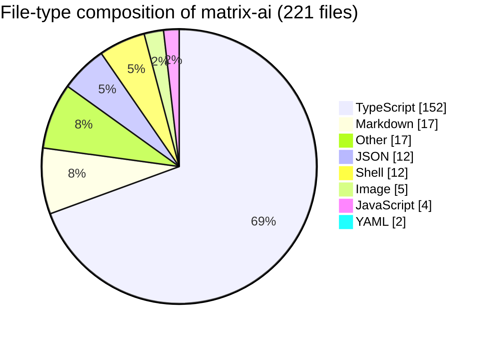

# matrix-ai

**Status — pre-release:** This is an **experimental v0.x** build. Behavior and schemas may change without notice. Automated coverage is **limited**; do not treat outputs as production-ready compliance or safety guarantees—validate in your own environment.

Local lab for **inspectable AI outputs**: generate a candidate answer with [MiniMax](https://platform.minimax.io/docs/api-reference/text-chat) (`M2-her`), then run a **structured equity / terminology audit** with JSON validation and an optional HTML report.



## Table of contents

- [Probe pipeline (algorithm)](#probe-pipeline-algorithm)
- [Audit sequence](#audit-sequence)
- [Optional local clones](#optional-local-clones)
- [Quick start](#quick-start)
- [Security](#security)
- [🗺️ Repository map](#️-repository-map)
- [📊 Code composition](#-code-composition)

## Probe pipeline (algorithm)



## Audit sequence



## Optional local clones

Not tracked in this repo (avoids broken nested-git commits):

```bash
git clone git@github.com:dioptx/mcp-atom-of-thoughts.git mcp-atom-of-thoughts
git clone https://github.com/ix-infrastructure/Ix.git Ix
```

- **mcp-atom-of-thoughts** — MCP reasoning graph toolkit.
- **Ix** — system / codebase mapping CLI ([upstream](https://github.com/ix-infrastructure/Ix)).

## Quick start

```bash
bun install
cp .env.example .env
# set MINIMAX_API_TOKEN
bun run probe --task "Your prompt" --html tmp/report.html --json tmp/report.json
```

Authoritative product intent lives in `docs/`. Tests are scoped to this repo via `bunfig.toml`.

## Security

Never commit `.env`. If a key was pasted into chat or logs, **rotate** it in the MiniMax console.


## 🗺️ Repository map

Top-level layout of `matrix-ai` rendered as a Mermaid mindmap (auto-generated from the on-disk tree).




## 📊 Code composition

File-type breakdown of source under this repo (skips `.git`, `node_modules`, build caches, lockfiles).


